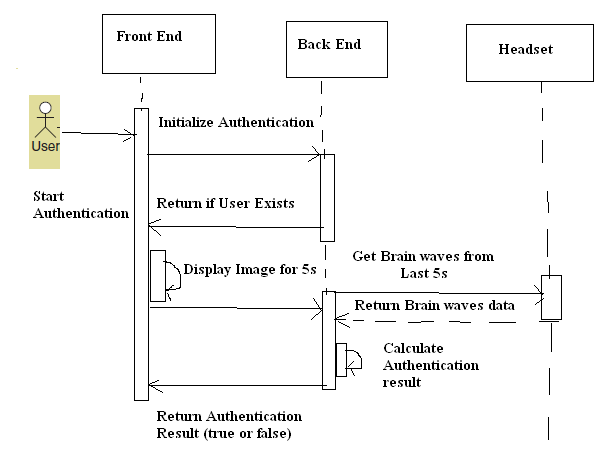
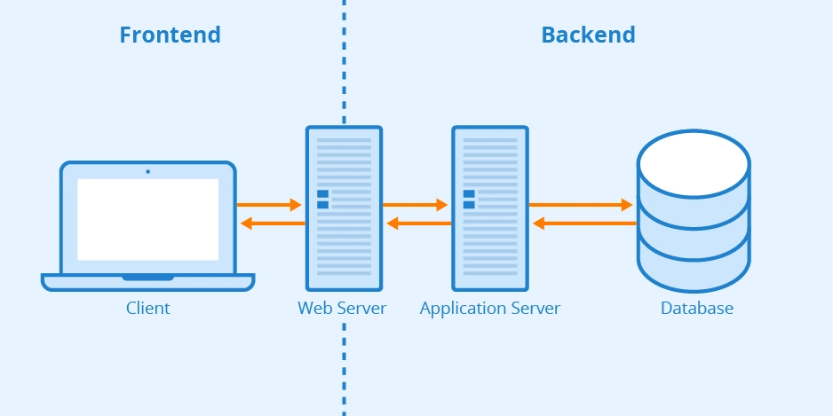
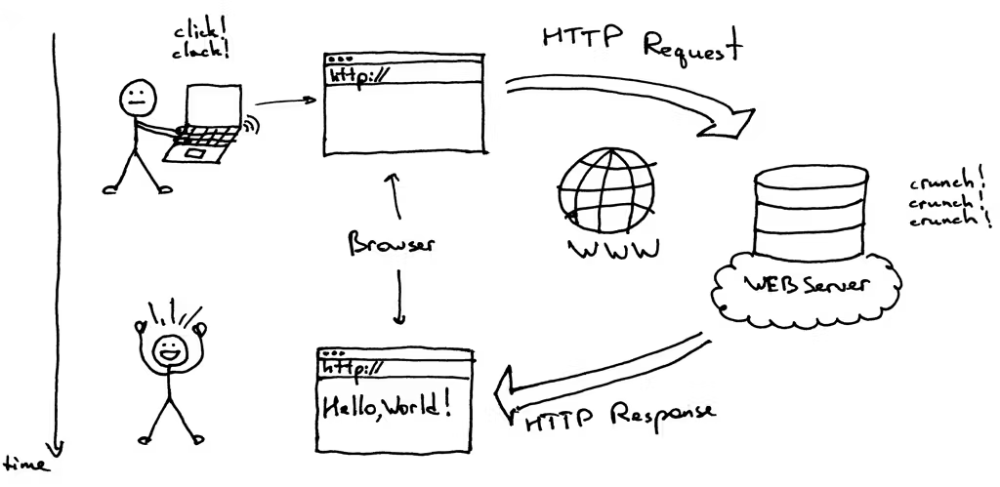

Web Application Fundamentals – Answers
Q1. Role of Frontend (FE)

The Frontend (FE) is a web application that users see and interact with in their browser. It is all about providing a smooth, responsive, and user-friendly experience.

1. User Interface

Frontend is in charge of the visual elements and their arrangement of a web application. It makes sure that the application is easy to use and looks the same across different and various devices.

2. User Interaction

All user actions such as clicking buttons, submitting forms, scrolling pages, and entering data are handled by frontend. It checks the input, provides feedback (like error messages) instantly, and updates the UI without reloading the whole page.

3. Communication with Backend

Using HTTP methods (GET, POST, PUT, DELETE), the frontend sends requests to the backend and gets responses in formats like JSON. The data is then processed by the frontend and meaningfully shown to the user.

---

Q2. Role of Backend (BE)

The Backend (BE) is the server-side portion of a web app that controls the logic, data, and security aspects of the application invisibly.

1. Server-Side Processing

The backend is the one that handles requests from the frontend, applies business logic, does calculations, and sends back responses. It guarantees the correct and efficient execution of application processes.

2. Database Handling

Backend services are the point of contact with databases for the operations of storing, retrieving, updating, and deleting data. The data here mainly consists of user accounts, application records, and transaction data, which are all managed in a way that ensures their integrity.

3. Security and Authentication

The backend is the security gate where the user identification, rights allocation, password coding, temporary access control, and defense against issues such as SQL injection or unauthorized access take place.

---

Q3. Business Logic

Business Logic denotes a collection of rules and decision-making processes that dictate how a web application responds to real-world needs. It indicates the outcome of particular actions taken.

Key Characteristics

1. Imposes rules that are specific to the business

2. Manages workflows and validations

3. Provides uniformity throughout the application

4. Real-World Examples

Real-world example

1. E-commerce Checkout

Applying discounts just in case a coupon is valid

Calculating tax by location

Permitting checkout only when stock is available

2. Banking Application

Prohibiting withdrawals when there is not enough balance

Implementing daily transaction limits

Assessing fines for late payments

3. Online Examination System

Shutting the exam once the time is up

Allowing only one submission per user

Determining final scores in accordance with rules

---

Q4. Client–Server Model

The Client–Server Model represents a communication framework where the functions are assigned between the requestors of the services and the providers of the services.

Client

Typically, the client is a web browser or mobile application that transmits requests and shows responses. It is the first one to communicate and it has the interaction with users.

Server

A server is a computing system that accepts client requests, takes the necessary actions, applies the business rules, and sends back the corresponding replies.

Communication Process

1. Client is making a request through the internet

2. Server is handling the request

3. Server is sending a reply back to the client

4. Client is showing the output to the user
   

---

Q5. Three-Tier Architecture

Three-Tier Architecture is a design pattern for web applications which consists of three distinct layers that can be operated separately one from another thereby making it easier to use the application without affecting its performance and at the same time protecting it against unauthorized access.

1. Presentation Layer

This is basically the part of the web application that the user sees and it interacts with the user. It is the main source of input for the users and the final destination for data meant for users.

2. Application (Business) Layer

All the core functionalities and the rules governing the application are provided in this layer. The layer is responsible for the communication between the frontend and backend as it processes the requests coming from the user and determines how the data should be treated.

3. Data Layer

The layer is in charge of the entire data management from databases to storage. It takes care of making data retained, conducting queries, and overseeing transactions.

Reasons for This Architecture

1. Increased scalability
2. Maintenance made easier
3. Security upgraded
4. Layers development made independent
   

---

Q6. JavaScript as a Backend Language

JavaScript is a ruling backend language that can be found in the major lists due to its ability to perform, flexibility, and a huge ecosystem.

1. Performance

JavaScript is based on an event-driven, non-blocking I/O model, which is the reason for its being efficient in the treatment of multiple concurrent requests with low latency.

2. Ecosystem

JavaScript is a language with a very large ecosystem from which thousands of libraries and tools can be accessed through package managers, thus facilitating the rapid development process and easy integration.

3. Popular Backend Frameworks

Express.js – minimalistic and adaptable
NestJS – orderly and gigantic
Fastify – great capacity backend framework
The use of JavaScript on both the frontend and the backend empowers developers to share code, reduce learning curves, and speed up development.
