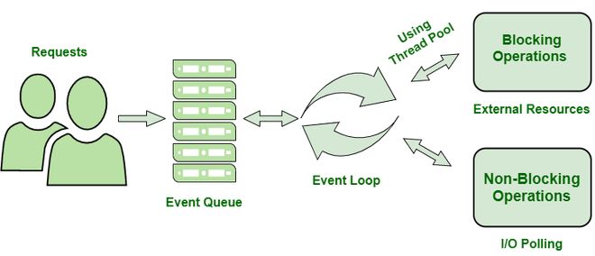
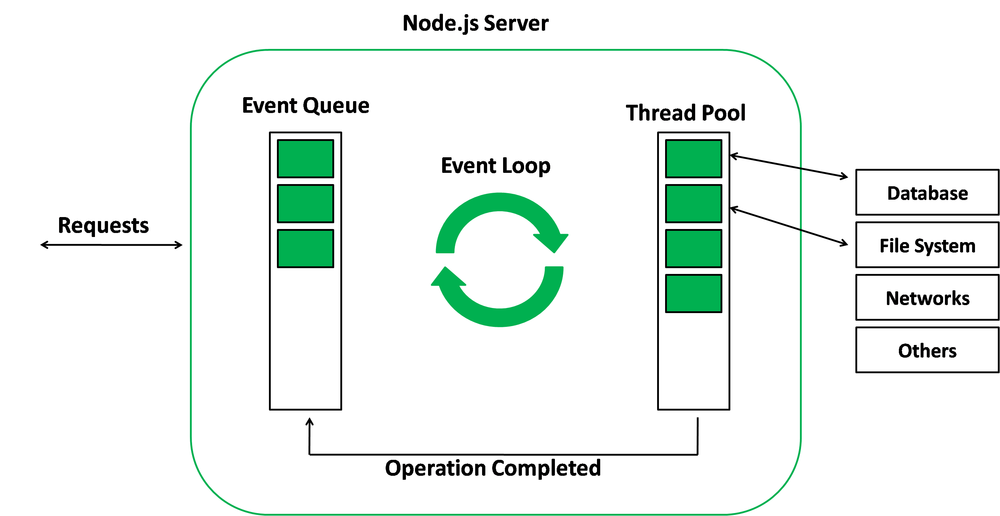

1. Node.js Architecture

The architecture of Node.js is grounded in a single-threaded, event-driven, non-blocking model. It manages to serve all the client requests properly without depending on the multiple threads.

. Key Points

Only one main thread is used to run JavaScript

All I/O operations occur in an asynchronous manner

An event loop takes care of the execution flow

Background handling is the place for heavy task processing

. Benefit

Very high scalability and very low memory consumption

\*JavaScript Engine (V8)

The V8 is the JavaScript engine used by Node.js to execute JavaScript code on the server.

. Key Points

Converts JavaScript into machine code

Uses Just-In-Time (JIT) compilation

Handles memory management and garbage collection

. Importance

Enables fast and efficient JavaScript execution

\*Node.js Core APIs

Node.js Core APIs are built-in modules that provide essential server-side features.

. Purpose

Enable file system access

Support networking and HTTP servers

Provide system-level utilities

. Advantage

No need for external libraries for basic operations

\*Native Bindings

Native bindings are the link between JavaScript and C/C++ code in Node.js.

. Why They Are Needed

JavaScript cannot directly access OS-level features

Core Node.js is written in C/C++

. Role

Convert JavaScript calls into native system operations

Improve performance for low-level tasks

\*Event Loop

The Event Loop is the mechanism that allows Node.js to execute asynchronous tasks without blocking the main thread.

. How It Works

Executes synchronous code first

Processes completed async callbacks

Continuously checks task queues

. Importance

Keeps applications responsive

Enables handling of multiple requests concurrently

---

2. libuv
   What is libuv?

libuv is basically a low-level C library that Node.js employs to deal with asynchronous operations. It is the main component that makes it possible for Node.js to execute non-blocking input/output operations and control the event loop on various operating systems.

Why does Node.js need libuv?

Node.js requires libuv because JavaScript cannot on its own directly use the OS features such as file systems, networking, and timers.

- libuv assists Node.js in the following ways:

1. Making asynchronous I/O very efficient

2. Keeping the ability to run on different platforms without changes

3. Preventing the main JavaScript thread from being blocked

4. Operating at the OS level in a uniform manner

Without libuv, Node.js would not have been able to produce its non-blocking and event-driven character.

- Responsibilities of libuv

. libuv takes care of:

1. The implementation and management of the event loop

2. The handling of asynchronous file system operations

3. The management of network operations and sockets

4. The provision of a thread pool for blocking tasks

5. The management of timers and system-level events

---

3. Thread Pool

- What is a thread pool?

A thread pool is defined to be a collection of threads that execute tasks in the background, and these tasks are the ones that do not block the main Node.js event loop. The threads exist in parallel and take care of operations that are either very time-consuming or blocking.

- Why does Node.js use a thread pool?

. Node.js employs a thread pool for the following reasons:

1. To avoid the blocking of the primary JavaScript thread.

2. To keep the application highly responsive.

3. To perform those tasks which the operating system cannot do asynchronously

4. To enhance the performance of the application that is executing heavy operations.

- Which operations are to be performed by the thread pool?

. The thread pool is responsible for:

1. Operating on the file system (reading/writing files)

2. Pertaining to cryptographic functions (hashing, encryption)

3. Doing compression and decompression

4. Running DNS lookups.

---

4. Worker Threads
   What are worker threads?

Worker threads are distinct JavaScript execution threads that let Node.js execute JavaScript in parallel, detached from the main thread.

- Why are worker threads needed?

. Worker threads are required to:

1. Do CPU-heavy calculations
2. Prevent the event loop from being blocked
3. Speed up the processing of heavy tasks
4. Allow real parallel execution of JavaScript code

- Difference between thread pool and worker threads

1. Thread Pool is run by Node.js internally, while Worker Threads are made and managed by programmers.

2. Thread Pool executes native and blocking operations, whereas Worker Threads executes JavaScript.

3. Thread Pool has a limited and fixed number of threads, while Worker Threads can be made as needed.

4. Thread Pool is not available for developers’ usage, while Worker Threads give complete control.

5. Thread Pool is primarily for I/O-related tasks while Worker Threads are for CPU-intensive computations.

---

4. Event Loop Queues

Event Loop Queues are data structures used by Node.js to store asynchronous tasks that are waiting to be executed by the event loop. These queues help Node.js manage task execution order without blocking the main thread.

Macro Task Queue

The Macro Task Queue contains tasks scheduled to run in future event loop cycles.

Characteristics

Executed after micro tasks are completed

Handles larger, time-based, or I/O-related tasks

Examples of Macro Tasks

setTimeout()

setInterval()

setImmediate()

I/O callbacks (file system, network events)

Micro Task Queue

The Micro Task Queue contains high-priority tasks that must be executed immediately after the current JavaScript execution completes.

Characteristics

Executed before macro tasks

Ensures critical callbacks run as soon as possible

Examples of Micro Tasks

Promise.then() callbacks

process.nextTick()

queueMicrotask()

Execution Priority Between Macro and Micro Tasks

The execution order followed by Node.js is:

Current synchronous JavaScript execution

Micro Task Queue (highest priority)

Macro Task Queue

This priority system ensures that important callbacks are executed without delay.
